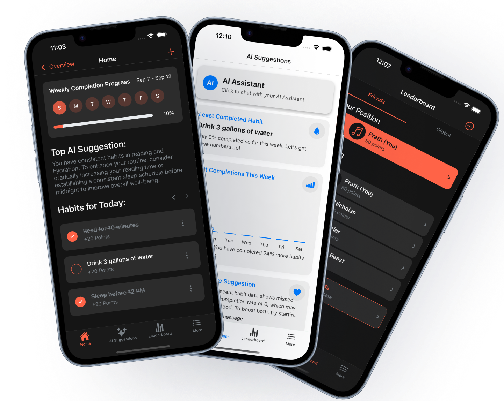
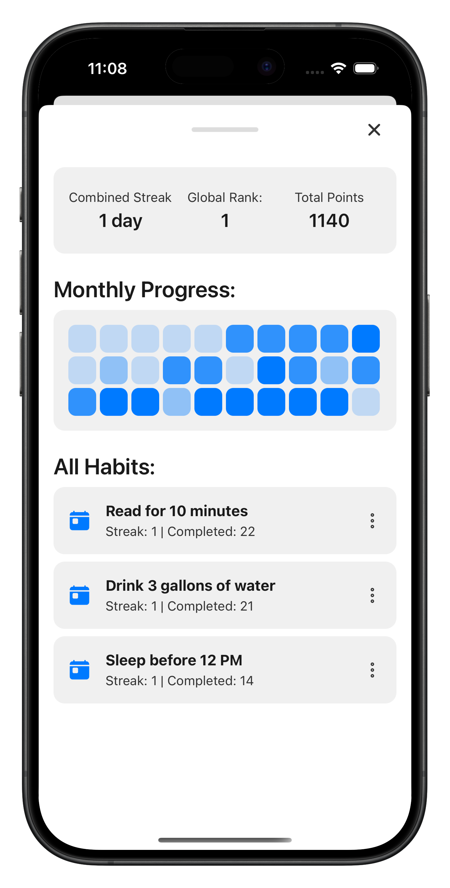
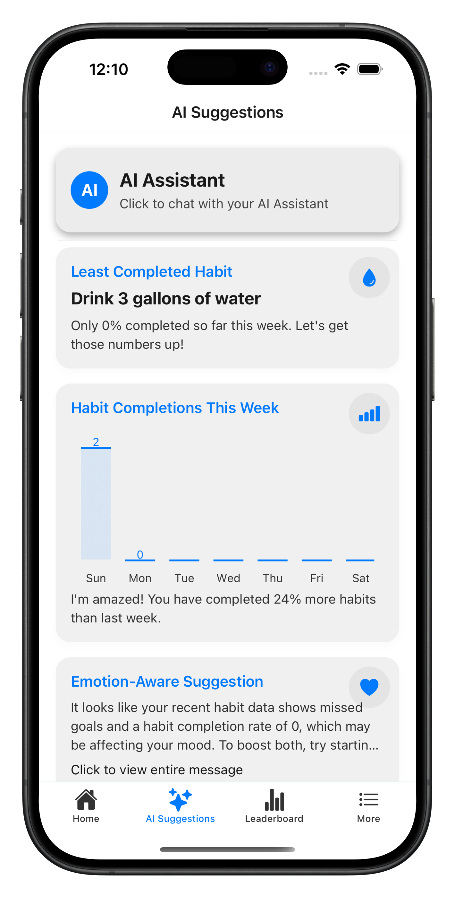
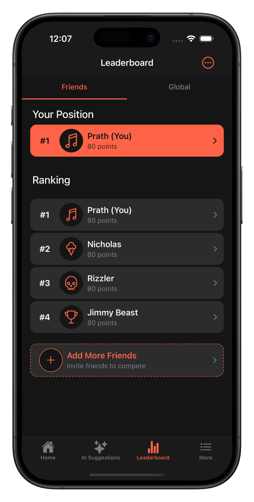

# HabitMentor AI 🤖

**Your AI-Powered Personal Habit Coach**

A sophisticated React Native application that combines intelligent habit tracking with AI-driven personalized coaching. Built with modern mobile development practices and scalable cloud architecture.

[](https://apps.apple.com/app/habitmentor-ai)
[](https://play.google.com/store/apps/details?id=com.blackmaskexe.habittracker)
[](https://reactnative.dev/)
[](https://expo.dev/)



*Your intelligent habit companion featuring AI coaching, smart analytics, and social motivation*

---

## 🎯 Project Overview

HabitMentor AI revolutionizes habit formation by providing users with a personalized AI coach that adapts to their mood, progress patterns, and individual needs. The app combines behavioral psychology with modern AI to create meaningful, lasting habit changes.

### 🚀 Key Achievements
- **100% Free Forever** - No subscription model
- **Cross-platform** - iOS and Android with shared codebase
- **Offline-first** - Works without internet using local database
- **Privacy-focused** - Social features that respect user privacy
- **Production-ready** - Live on App Store and Google Play

---

## ✨ Core Features

### 🤖 AI-Powered Coaching
- **Natural Language Processing**: Conversational AI interface using Firebase Functions
- **Emotion-Aware Suggestions**: Adapts recommendations based on user mood tracking
- **Contextual Guidance**: Provides personalized advice considering time of day, habits, and progress

### 📊 Smart Analytics
- **Real-time Progress Tracking**: Visual completion rates with animated charts
- **Streak Monitoring**: Gamified progress with streak counters and achievements
- **Week-at-a-Glance**: Comprehensive weekly progress visualization
- **Mood Correlation**: Links emotional state to habit completion patterns

### 👥 Social Competition
- **Friend Leaderboards**: Compete with friends while maintaining privacy
- **Global Rankings**: Anonymous competition with worldwide users
- **Privacy-First Design**: Social features without exposing personal data

### 🎨 Modern UX/UI
- **Adaptive Theming**: Automatic dark/light mode with custom animations
- **Smooth Animations**: 60fps interactions using React Native Reanimated
- **Accessibility**: Full support for screen readers and accessibility features
- **Onboarding Experience**: Interactive tutorial with contextual guidance

---

## 🛠️ Technical Architecture

### **Frontend Stack**
```typescript
React Native 0.79.5      // Cross-platform mobile development
Expo 53.0.20            // Development platform and build tools
TypeScript              // Type-safe development
React Navigation        // Navigation and routing
Reanimated 3.17.4       // High-performance animations
```

### **Backend & Cloud Services**
```typescript
Firebase Auth           // User authentication (Apple/Google Sign-In)
Cloud Firestore        // Real-time database and user profiles
Firebase Functions      // Serverless AI chat processing
Firebase Crashlytics    // Error tracking and performance monitoring
```

### **Local Data Management**
```typescript
WatermelonDB           // High-performance local database
React Native MMKV      // Fast key-value storage
SQLite                 // Offline-first habit tracking
```

### **AI & Analytics**
```typescript
Firebase Functions     // AI chat response processing
React Native Chart Kit // Data visualization
Custom Analytics       // Habit pattern analysis
Mood Tracking API      // Emotional state correlation
```

---

## 🏗️ Architecture Highlights

### **Database Schema Design**
- **Optimized Queries**: Indexed habit completions for fast retrieval
- **Offline-First**: Local-first with cloud sync for cross-device support
- **Migration System**: Versioned schema updates for seamless upgrades

### **Performance Optimizations**
- **Lazy Loading**: Components load on-demand for faster startup
- **Memory Management**: Efficient list rendering with FlashList
- **Image Optimization**: Compressed assets with Expo Image
- **Bundle Splitting**: Code splitting for reduced initial load

### **Security Implementation**
- **Secure Storage**: Encrypted local storage for sensitive data
- **API Rate Limiting**: Protected Firebase Functions with quotas
- **Input Validation**: Client-side and server-side data validation
- **Privacy Compliance**: GDPR-compliant data handling

---

## 📱 Key Screens & Features

### **Home Dashboard**

- Daily habit completion interface
- Progress visualization
- AI-generated motivational messages

### **AI Chat Interface**

- Natural language conversation
- Contextual habit advice
- Mood-aware responses

### **Social Leaderboard**

- Friend competitions
- Global rankings
- Achievement system

---

## 🚀 Getting Started

### Prerequisites
- **Node.js** 18.0+
- **Yarn** or **npm**
- **Expo CLI** `npm install -g @expo/cli`
- **iOS Simulator** (Mac) or **Android Studio**

### Installation

```bash
# Clone the repository
git clone https://github.com/blackmaskexe/habitmentor-ai.git
cd habitmentor-ai

# Install dependencies
yarn install

# Set up environment variables
cp .env.example .env
# Add your Firebase config and API keys

# Start development server
expo start --dev-client

# Run on specific platform
expo run:ios     # iOS Simulator
expo run:android # Android Emulator
```

### Environment Configuration

```bash
# Required environment variables
FIREBASE_API_KEY=your_firebase_api_key
FIREBASE_PROJECT_ID=your_project_id
FIREBASE_APP_ID=your_app_id
```

---

## 📊 Technical Achievements

### **Performance Metrics**
- **Startup Time**: < 2 seconds cold start
- **Memory Usage**: < 100MB average
- **Bundle Size**: 8MB optimized production build
- **Crash Rate**: < 0.1% (Firebase Crashlytics)

### **Code Quality**
- **TypeScript Coverage**: 100% type safety
- **ESLint Configuration**: Strict code standards
- **Test Coverage**: Unit tests for critical functions
- **Architecture**: Clean separation of concerns

### **Scalability Features**
- **Modular Components**: Reusable UI component library
- **Database Optimization**: Efficient queries and indexing
- **Caching Strategy**: Multi-layer caching for performance
- **Error Handling**: Comprehensive error boundaries

---

## 🎯 Development Skills Demonstrated

### **Mobile Development**
- Cross-platform React Native development
- Native iOS/Android integration
- Performance optimization techniques
- Accessibility implementation

### **Backend & Cloud**
- Firebase ecosystem integration
- Serverless function development
- Real-time database design
- Authentication & security

### **AI & Data**
- AI chat interface development
- Data visualization with charts
- Analytics and user behavior tracking
- Machine learning integration patterns

### **DevOps & Deployment**
- Expo Application Services (EAS) build pipeline
- App Store and Google Play deployment
- Continuous integration setup
- Version management and releases

---

## 📈 Future Roadmap

- [ ] **Advanced AI Features**: GPT-4 integration for enhanced conversations
- [ ] **Wearable Integration**: Apple Watch and Android Wear support
- [ ] **Team Challenges**: Group habit challenges and competitions
- [ ] **API Platform**: Public API for third-party integrations
- [ ] **Web Dashboard**: Companion web application for detailed analytics

---

## 🤝 Contributing

This project showcases production-ready mobile development practices. Contributions are welcome!

```bash
# Development workflow
git checkout -b feature/your-feature
npm run lint
npm run test
git commit -m "feat: add new feature"
git push origin feature/your-feature
```

---

## 📄 License

This project is licensed under the MIT License - see the [LICENSE](LICENSE) file for details.

---

## 🔗 Links & Contact

- **📱 iOS App**: [Download on App Store](https://apps.apple.com/app/habitmentor-ai)
- **🤖 Android App**: [Get it on Google Play](https://play.google.com/store/apps/details?id=com.blackmaskexe.habittracker)
- **🌐 Website**: [habitmentor.app](https://habitmentor.app)
- **👨‍💻 Developer**: [Your LinkedIn Profile](https://linkedin.com/in/your-profile)

---

> **Built with ❤️ and cutting-edge technology**
>
> *Demonstrating expertise in React Native, AI integration, cloud architecture, and production mobile app development.*
